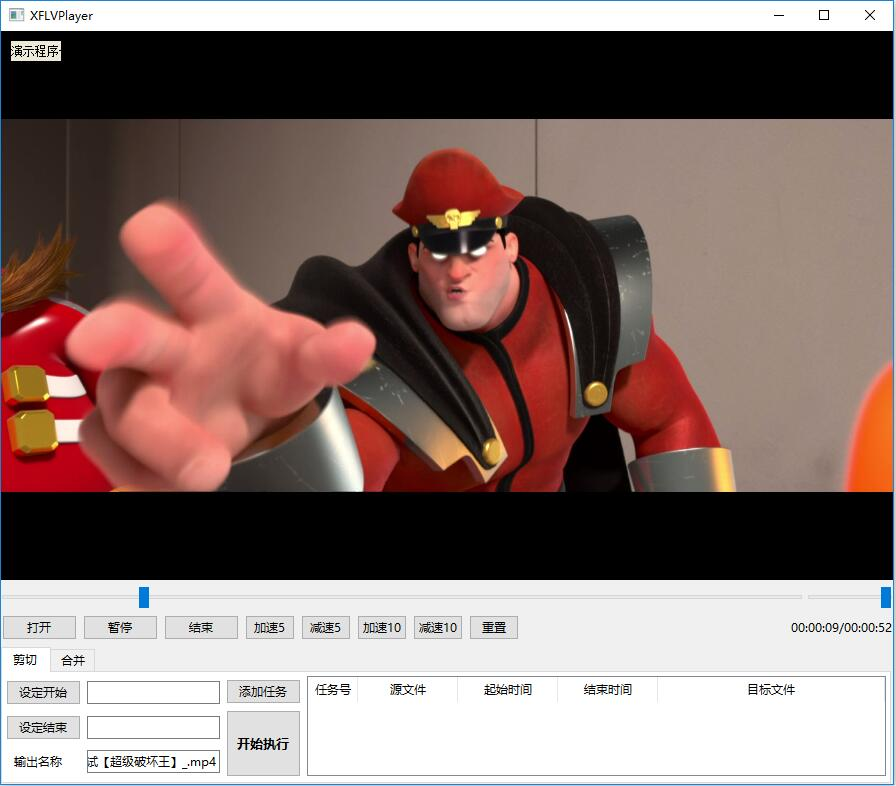
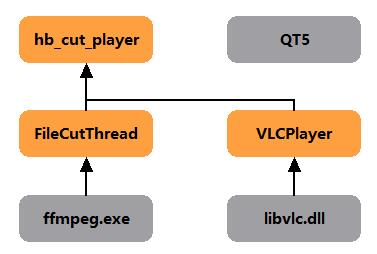
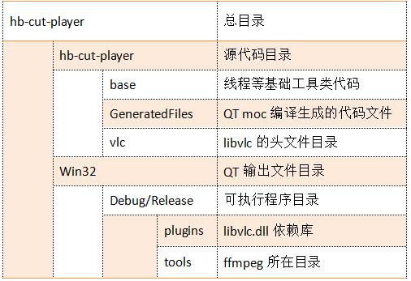

# [开源]基于ffmpeg和libvlc的视频剪辑、播放器

> 以前研究的时候，写过一个简单的基于VLC的视频播放器。后来因为各种项目，有时为了方便测试，等各种原因，陆续加了一些功能，现在集成了视频播放、视频加减速、视频剪切，视频合并（增加中）等功能在一起。有时候看点网上下载的视频，可以一边看，一边能处理视频前后的广告，感觉也还可以用，就想把它开源出去，一方面希望有需要的朋友可以参考、借鉴，另一方面也希望可以促进它进一步的丰富功能，最终能实现一款简单又够用的视频剪辑软件。

## 程序框架
先上一张程序截图

基本上讲，它的播放功能是基于VLC，剪辑功能是基于FFmpeg，现在的功能还比较简单，当然我的目的也不是想做一个复杂的视频编辑器，那是专业软件的事情，就是想做一个简单又好用的剪辑工具即可。整体框架如下图所示：

## 源码简介

### 工程

程序目前使用VS2013开发，并通过Qt VS Addin创建QT工程，界面基于QT5来编写。将来准备改为QtCreator工程，目的是为了方便移植到linux平台。

主要逻辑是：QT绘制界面，跟用户交互，通过调用libvlc，实现本地文件播放。在适当的地方设置剪辑参数，然后通过FFMPEG实现视频文件剪辑，完成后，反馈到QT界面。

和普通播放器类似，程序支持左"<-",右"->"快捷键来做视频的快进后退，也可配合Ctrl和Shift键来做。

### 代码目录

## 开发计划

* 开发工具由VS2013切换为QtCreator
* 文件播放部分，由目前的调用libvlc，改为通过FFMPEG解码后，渲染播放。
* 剪辑操作，由进程调用FFMPEG程序，改为通过FFMPEG API方式
* 增加视频文件合并，以及格式转换
* 界面改善

## 源码地址

https://github.com/hbstream/hb-cut-player

---

   **合作请联系QQ。（转载请注明作者和出处~）**

---