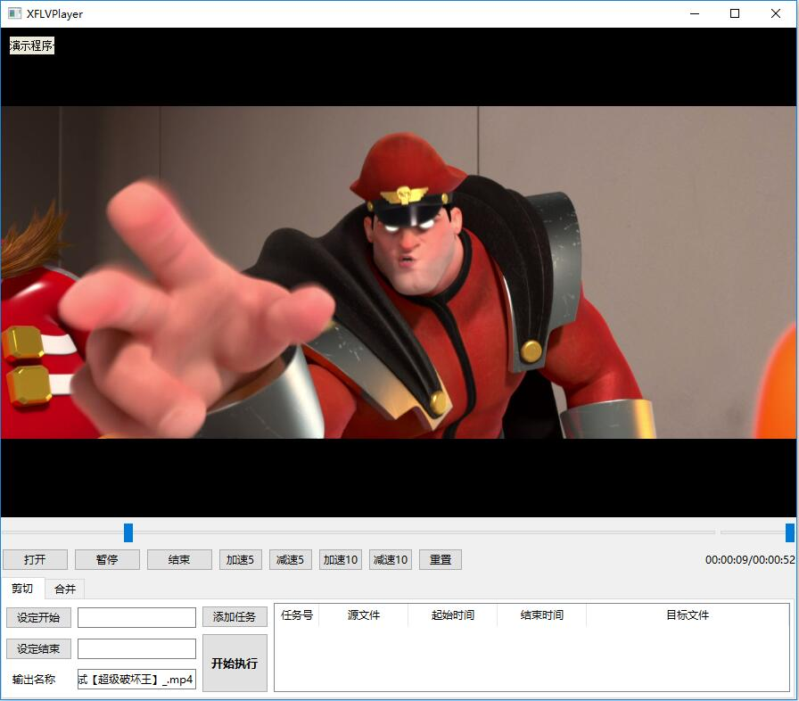
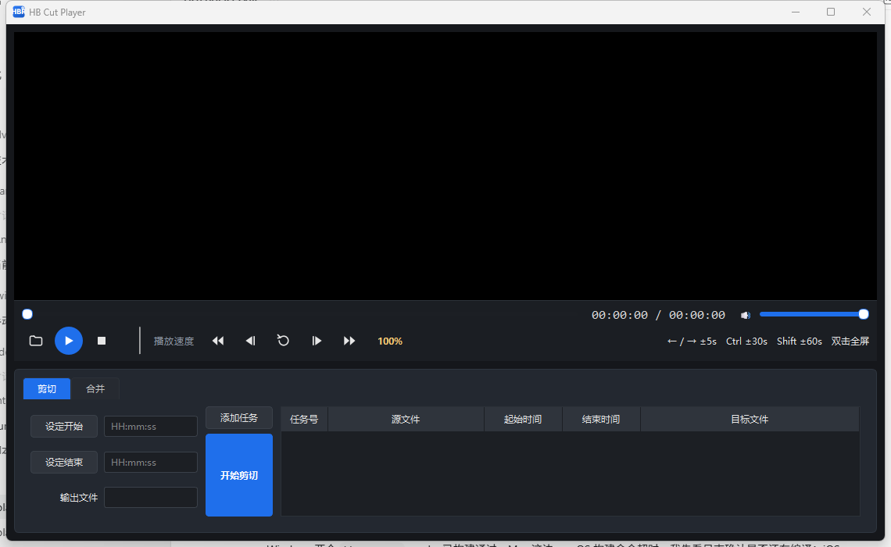
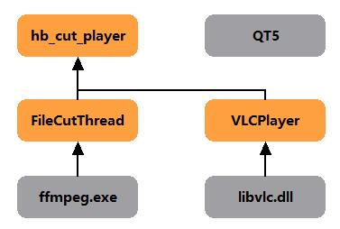

# [开源] 基于 FFmpeg 和 libVLC 的视频剪辑 / 播放器

> 早年研究的时候写过一个简单的基于 VLC 的视频播放器；后来配合各种项目陆续加了一些功能 —— 视频播放、加 / 减速、剪切、合并（开发中）等等。
> 一边看下载下来的视频一边把片头片尾的广告剪掉，确实挺顺手，于是把它开源出来：一方面给有需要的朋友做参考，另一方面也希望随着开源完善，能逐渐变成一个简单又够用的视频剪辑工具。

## 程序界面

> 旧版（VS2013 + Qt 5）



> 新版（Qt 6.10 + CMake 现代化重做）



整体框架沿用：播放走 libVLC，剪切走 FFmpeg。



## 构建（Windows / 64 位）

### 依赖

- Visual Studio 2022（或更新的 MSVC 工具链）
- Qt 6.10.x，msvc2022_64 套件，默认查找 `C:/Qt/6.10.3/msvc2022_64`
- VLC 3.x 64 位桌面版，安装在默认位置 `C:/Program Files/VideoLAN/VLC`
- CMake 3.21+

### 步骤

```powershell
# 1) 从系统 VLC 现场生成 64 位导入库（首次构建必须执行）
powershell -NoProfile -ExecutionPolicy Bypass -File scripts/gen_vlc_import_libs.ps1

# 2) 配置 + 编译
powershell -NoProfile -ExecutionPolicy Bypass -File scripts/build.ps1
```

构建产物在 `build/Release/`，已经通过 `windeployqt` 把 Qt 运行时与 VLC 插件目录一起部署进去，可以直接双击 `hb-cut-player.exe` 运行。

> 仓库里 `hb-cut-player/vlc/` 下自带的 32 位 `.lib` 是历史 Qt 5 + VS2013 32 位工程留下的，新构建不会再用到，保留只是为了让旧工程也能打开。

### 老 VS2013 工程

仓库里仍然保留了 `hb-cut-player.sln` / `hb-cut-player.vcxproj`，作为存档；当前推荐的构建路径是 CMake。

## 操作

- 拖放视频文件到窗口即可播放
- 空格 = 播放 / 暂停；← / → = ±5s，Ctrl ±30s，Shift ±60s
- 双击视频区域全屏 / 退出全屏；Esc 退出全屏
- 剪切：在“剪切”页设定开始 / 结束时间和输出文件名，添加任务后点“开始剪切”

## 开发计划

- 把 ffmpeg 进程调用改为 ffmpeg API
- 实现“合并”页
- 视频解码改走 ffmpeg + 自渲染，避免依赖系统 VLC
- 跨平台支持

## 源码地址

https://github.com/hbstream/hb-cut-player

---

 **合作请联系 QQ。（转载请注明作者和出处）**

---
